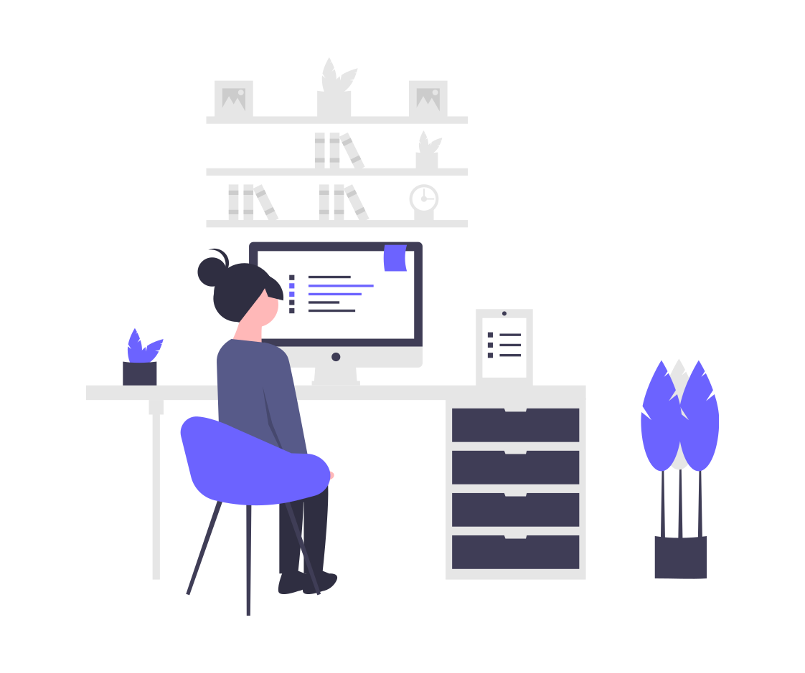

## A little bit about me 

**Hi there 👋**

I am Claire, from London and a full stack software developer in the making. 

A couple of years ago, before starting the full stack course with code institute, I developed an integrated booking app using Zoho Creator for a company offering property services - with zero coding experience.  

This experience was the catalyst that would start my coding journey, I learnt so much in the process but I discovered two things:    

  - I was only scratching the surface and, 
  - Software development would not only be a career to aim for, but also a passion to follow. 

## Stack 

- ### **In my stack**

                

- ### **Learning in progress**         

           

## Objectives

   - My objectives are also to learn React and Node.js       
         

## GitHub statistics

 

 

## Contacts

 
 

## Credits

Thank you [Terence Eden & co](https://github.com/edent/SuperTinyIcons) and [devicon](https://github.com/devicons) for the icons and [Anurag Hazra](https://github.com/anuraghazra/github-readme-stats) for the GitHub stats
